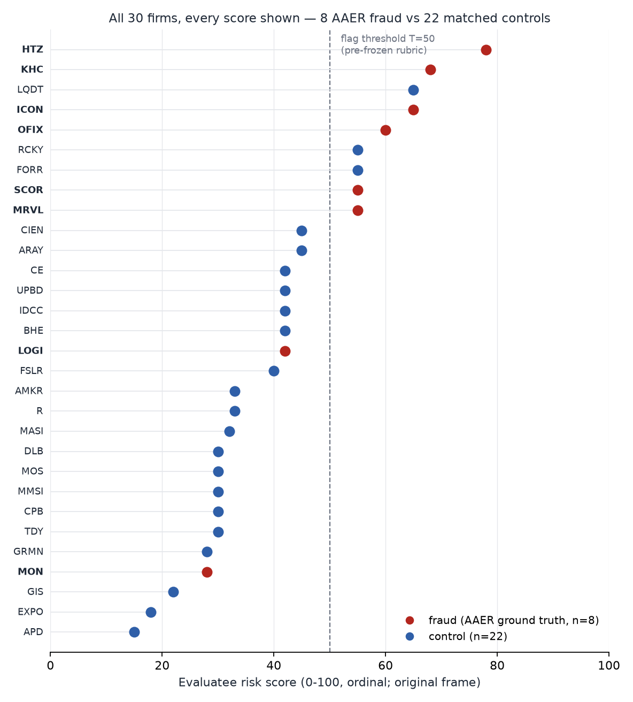

# AAER Evals — can an AI flag risky accounting from the filings alone?

[](https://github.com/lastwhisper906-gif/aaer-evals/actions/workflows/ci.yml)

**The question.** If you show an AI model only the financial disclosures a
company had published up to a chosen date — no news, no hindsight — can it
tell which companies later became SEC accounting-enforcement cases? (Those
cases are called AAERs: the SEC's formal accounting-misconduct releases,
which is where this project's name comes from.)

**The answer so far.** The enforcement cases did score visibly higher than
clean-record companies matched on industry, size, and era, consistently
enough that chance is an unlikely explanation (the statistical tests live
one scroll down) — but part of that score is the model *remembering
companies by reputation*, not reading their numbers. When we disguised the
companies' identities, Hertz's risk score dropped 23 points (78 → 55) while
Monsanto's rose 30 (28 → 58): name-memory cuts both ways, so every published
number in this repository carries that caveat next to it. The deeper
hindsight risk — what the model absorbed in its own training — is exactly
what the name-masking experiments below are designed to measure.



*Every score from test wave 1, nothing summarized: enforcement cases in red,
matched controls in blue. The separation is visible — and so is the overlap,
which is why no single alert threshold works (companion chart:
[threshold tradeoff](analysis/fig_tradeoff.png)).*

**Check it yourself** — five minutes, no accounts, no data downloads. This
recomputes every published number from the outputs committed here (it does
not re-call the AI — that distinction, and a fuller reproduction ladder, is
documented below):

```bash
git clone https://github.com/lastwhisper906-gif/aaer-evals && cd aaer-evals
python3.12 -m venv .venv && .venv/bin/pip install --require-hashes -r requirements.lock
make verify-public
```

---

## Scope & attribution

> Authored by Claude Code, pending human audit (GA-001 (b), D15).
> Who did what: [CONTRIBUTIONS.md](CONTRIBUTIONS.md) (AI-vs-human table, D106 ⑤).
> All results are scoped to a single Claude-based pipeline (evaluatee pinned to
> claude-sonnet-5; PROJECT.md §5-5). Grading: Claude-assisted, human-finalized.
> 한국어 원문(전체 서사): [README.ko.md](README.ko.md).

No positions · educational/informational · not investment advice. Scores are
ordinal ranks (0–100), not calibrated probabilities. "Control" means no
enforcement action was found, not that the company is clean.

## What this is

This repository backtests one question — **can an LLM screen for misstatement
risk from point-in-time structured disclosure data alone?** — against SEC
enforcement (AAER) confirmed cases with matched non-enforcement controls, plus
a post-training-cutoff holdout where memorization is structurally impossible.
It is an existence-proof record with its full audit trail, not a product:
no positions · educational/informational · not investment advice.

<details>
<summary><b>The headline finding, with its limits</b> (full detail — same
figure and commands as above, kept verbatim for citability)</summary>

## The headline finding, with its limits

**There is no dominant single-threshold LLM strategy on the trajectory layer
(exploratory E2).** At threshold T≥50 that layer detects 12/12 treatment cases
(CP95 [73.5%, 100%]) but false-alarms on 5/7 controls (**71.4%**, CP95
[29.0%, 96.3%]); tightening to T=70 kills detection first (1/12). Cost per
detection and every cell's CP95 interval: [`analysis/DECISION_TABLE.md`](analysis/DECISION_TABLE.md)
(owner-signed, D94).

What survives honest scrutiny is narrower: **within each layer independently,
treatment/control separation significance survives as memorization is
progressively removed** — wave-1 perturbed permutation p=0.0021 (N=8 vs 22;
identity-exposed upper line p=0.00114), wave-2 standalone p=0.00116, AUC 0.829
[0.616, 0.983] (N=9 vs 23), and per-case persistence in the post-cutoff
holdout (N=3 — per-case evidence only, no significance claim; the single top
score in that tier is a control false positive, GridAI **GRDX 78**).

The limits, inline: false positives are real — [TASK 1] wave-1 FPR 3/22 =
**13.6%** CP95 [2.9%, 34.9%], wave-2 FPR 5/23 = **21.7%** CP95 [7.5%, 43.7%];
[TASK 2] holdout controls (E1) 2/9 = 22.2% CP95 [2.8%, 60.0%] — never summed
across tiers. Scores are **ordinal (0–100), not probabilities** (wave-2 ECE
**0.179**, wave-1 0.209 — uncalibrated). Residual memorization is measured,
not eliminated (name-ID **21.9%** on wave-2, frozen rule; 50% on wave-1).
Controls mean "not enforced against," not "clean." Every published number with
its row-level limit: [`RESULTS.md`](RESULTS.md).


*Every wave-1 score shown, no summary: 8 AAER treatment cases vs 22 matched
controls on the original (identity-exposed) frame — the separation evidence
behind the wave-1 numbers above, overlap included. Generated by
[`analysis/fig_dotplot.py`](analysis/fig_dotplot.py). Companion figures:
[reliability](analysis/fig_reliability.png) ·
[memorization dose-response](analysis/fig_memorization_doseresponse.png) ·
[memorization decomposition](analysis/fig_memorization_decomposition.png) ·
[headline threshold tradeoff](analysis/fig_tradeoff.png) (detection vs
false-positive rate with CP95, [source](analysis/fig_tradeoff.py); row 13's
no-dominant-strategy finding as one chart).*

## Quickstart (5 minutes, zero external data)

```bash
git clone https://github.com/lastwhisper906-gif/aaer-evals && cd aaer-evals
python3.12 -m venv .venv
.venv/bin/pip install --require-hashes -r requirements.lock
make verify-public   # recomputes every published number from committed artifacts
```

`verify-public` needs no corpus, no API key, no network — enforced
structurally on every run by `make verify-public-sandboxed` (a
no-network/no-external-read guard wrapping the full gate; historical
transcript: `audit/verify_public_sandbox_transcript_20260722.txt`,
2026-07-22 gate set).
Corpus-dependent full reproduction: `make verify-full` (`REPRODUCING.md`).

<!-- BEGIN-GENERATED: repro-facts (refresh: make docs-refresh; CI: tools/lint_doc_counts.py) -->
- data manifest: **538 files** (`data/manifests/aaer_data_manifest.json` · `file_count`)
- pytest: **370 tests collected** (`pipeline tools scoring analysis`)
- `make verify-public` (zero external data):
  - `.venv/bin/python tools/reproduce_analysis.py`
  - `.venv/bin/python tools/lint_publication.py`
  - `.venv/bin/python tools/lint_doc_counts.py`
  - `.venv/bin/python -m pytest pipeline tools scoring analysis -q`
  - `.venv/bin/python tools/verify_manifest.py --schema-only`
  - `.venv/bin/python tools/verify_blindness.py`
  - `.venv/bin/python tools/verify_figures.py`
- `make verify-full` (requires `~/aaer-data` corpus; see REPRODUCING.md §2):
  - `.venv/bin/python tools/verify_manifest.py`
  - `.venv/bin/python analysis/baselines.py`
  - `.venv/bin/python analysis/stats.py`
  - `.venv/bin/python analysis/synthesis.py`
  - `.venv/bin/python analysis/calibration_wave2.py`
  - `$(MAKE) verify-public`
<!-- END-GENERATED: repro-facts -->


</details>

## Want to check our work?

- **[METHOD.md](METHOD.md)** — the pipeline on one page: payload assembly,
  fail-closed cutoff guard, isolated single call, schema-forced output,
  deterministic citation verification, human adjudication; the leakage threat
  model; the role-split contract (Python computes, the LLM judges
  qualitatively, a human signs).
- **[RESULTS.md](RESULTS.md)** — one table of published numbers, each row
  carrying its own limit.
- **[CLAIMS.json](CLAIMS.json)** — the same table machine-readable
  (number → source artifact → limitation), drift-locked to RESULTS.md.
- **[AUDIT_INDEX.md](AUDIT_INDEX.md)** — what D/Q/RP/FREEZE_REV identifiers
  mean, where each ledger lives, one real decision traced end-to-end.
- **[Licensing](#licensing)** — license status (below).

Detailed narrative (three-task separation, three-layer headline, false
positives, baselines, limitations — relocated copies):
[`docs/README_DETAIL.md`](docs/README_DETAIL.md).

## Feedback

Reproduction results (successes *and* failures) and methodology questions
are both welcome — [open an issue](https://github.com/lastwhisper906-gif/aaer-evals/issues/new/choose)
using the **reproduction-report** or **methodology-question** template
(`.github/ISSUE_TEMPLATE/`). Identifier lookups first: [AUDIT_INDEX.md](AUDIT_INDEX.md).

## Publication (v1.0 — 2026-07-11, owner-signed D40/D41)

Published as GitHub Issues (series 0/1/2 = GitHub #1/#2/#3); the posted issues
are the publication surface, `analysis/ISSUE_*_DRAFT.md` the frozen sources.

- **Issue 0** (wave-1, R3 — memorization-entangled): <https://github.com/lastwhisper906-gif/aaer-evals/issues/1>
- **Issue 1** (wave-2, R4 — residual capability, scoped): <https://github.com/lastwhisper906-gif/aaer-evals/issues/2>
- **Issue 2** (post-cutoff holdout, H2): <https://github.com/lastwhisper906-gif/aaer-evals/issues/3>
- **Citable freeze point**: release [v1.0.0](https://github.com/lastwhisper906-gif/aaer-evals/releases/tag/v1.0.0).
- **Post-publication notices**: partial de-identification of the v1 perturbed
  frame ([`docs/V1_PARTIAL_DEIDENTIFICATION_NOTE.md`](docs/V1_PARTIAL_DEIDENTIFICATION_NOTE.md));
  errata ([`ERRATA.md`](ERRATA.md)).

## Licensing

Dual-licensed by content type (Q-O10, owner-signed 2026-07-22):

- **Code — [Apache-2.0](LICENSE)** (explicit patent grant; modifications must
  be stated).
- **Documentation, published memos, analysis prose — [CC-BY-4.0](LICENSE-docs)**.
  Rationale for the split: attribution-required reuse keeps the published
  memos verifiable — any republication must trace back to the frozen
  originals in this repository.

© 2026 lastwhisper906-gif. Cite via `CITATION.cff` (DOI pending Q-R03).

