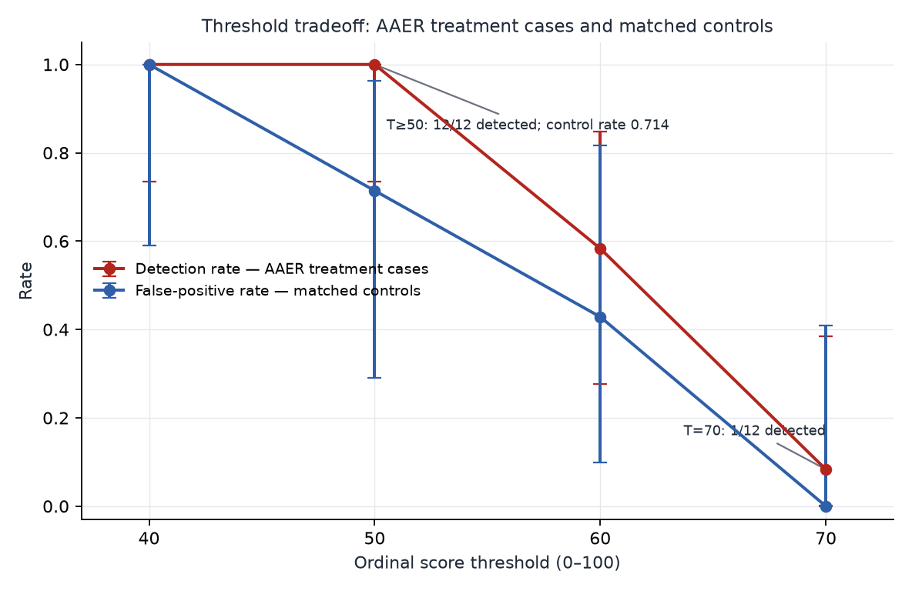

# DECISION_TABLE — Per-threshold decision table (buyer-language translation)

> Korean original: [DECISION_TABLE.ko.md](DECISION_TABLE.ko.md) (frozen).

> **Owner-signed 2026-07-16 (Q-O02, this session's structured decision
> responses; ledger D94).** Pre-registered: `analysis/DECISION_TABLE_PLAN.md`
> (standalone commit 2fc3d23 before computation) · numeric source:
> `analysis/decision_table.json` (`analysis/decision_table.py`, frozen-score
> reaggregation — new experiments · new metering: 0).

*Threshold sweep at a glance — detection rate and false-positive rate move
with the threshold (no dominant strategy). Regenerate:
`.venv/bin/python analysis/fig_tradeoff.py` (D-P43 owner-signed, Q-F17
default (C) executed).*

## 0. How to read this table

- The question: "If you cut at threshold T, what do you gain (flags), what
  do you falsely alarm on (false positives), and what does 1 detection
  cost?"
- Every rate carries its Clopper–Pearson 95% interval — **N is so small
  that a point estimate alone says nothing.** Continuous curves (ROC etc.)
  are deliberately not drawn, for the same reason.
- Scores are **ordinal** outputs on the 0–100 scale — not calibrated
  probabilities (ECE 0.209/0.179, `specs/calibration_scope.md`).
- Cost axis: **$0.5304** per screen (`analysis/BUYER_METRICS.md` §3
  measured — E2 log 158-call tokens, sonnet-5 list price $3/$15,
  cache-billing-equivalent weighting). Cost per detection = layer-wide
  screening cost ÷ detections. 0 detections → "—".

## 1. wave-1 perturbed (treatment 8 · control 8)

Treatment 8 cases in the identity-masked (perturbed) frame vs control
8 cases in the **original frame** — no perturbed-frame grading exists for
the controls, so the frames are asymmetric (no-new-grading contract). This
asymmetry remains a limit of this table.

| Threshold T | Flags (treatment, n=8) | 95% CI | False positives (control, n=8) | 95% CI | Cost per detection |
|---|---|---|---|---|---|
| ≥40 | 8/8 (100.0%) | [63.1%, 100.0%] | 3/8 (37.5%) | [8.5%, 75.5%] | $1.06 |
| ≥50 | 4/8 (50.0%) | [15.7%, 84.3%] | 1/8 (12.5%) | [0.3%, 52.6%] | $2.12 |
| ≥60 | 1/8 (12.5%) | [0.3%, 52.6%] | 0/8 (0.0%) | [0.0%, 36.9%] | $8.49 |
| ≥70 | 0/8 (0.0%) | [0.0%, 36.9%] | 0/8 (0.0%) | [0.0%, 36.9%] | — |

## 2. wave-2 (treatment 9 · control 23)

Fictional-name frame, identical protocol for treatment and control.

| Threshold T | Flags (treatment, n=9) | 95% CI | False positives (control, n=23) | 95% CI | Cost per detection |
|---|---|---|---|---|---|
| ≥40 | 8/9 (88.9%) | [51.7%, 99.7%] | 10/23 (43.5%) | [23.2%, 65.5%] | $2.12 |
| ≥50 | 7/9 (77.8%) | [40.0%, 97.2%] | 5/23 (21.7%) | [7.5%, 43.7%] | $2.42 |
| ≥60 | 3/9 (33.3%) | [7.5%, 70.1%] | 0/23 (0.0%) | [0.0%, 14.8%] | $5.66 |
| ≥70 | 2/9 (22.2%) | [2.8%, 60.0%] | 0/23 (0.0%) | [0.0%, 14.8%] | $8.49 |

## 3. holdout + E1 controls (event group 3 · control 9)

**Caution: the 3 cases here are not confirmed fraud but G2 provisional
labels (restatement/4.02 non-reliance events).** The column name must also
be read as "event flagging," not "detection." n=3 is case documentation,
not statistics.

| Threshold T | Flags (event group, n=3) | 95% CI | False positives (control, n=9) | 95% CI | Cost per detection |
|---|---|---|---|---|---|
| ≥40 | 2/3 (66.7%) | [9.4%, 99.2%] | 3/9 (33.3%) | [7.5%, 70.1%] | $3.18 |
| ≥50 | 1/3 (33.3%) | [0.8%, 90.6%] | 2/9 (22.2%) | [2.8%, 60.0%] | $6.36 |
| ≥60 | 1/3 (33.3%) | [0.8%, 90.6%] | 1/9 (11.1%) | [0.3%, 48.2%] | $6.36 |
| ≥70 | 1/3 (33.3%) | [0.8%, 90.6%] | 1/9 (11.1%) | [0.3%, 48.2%] | $6.36 |

## 4. E2 trajectories (treatment 12 · control 7 — multiple snapshots per case)

Flag = llm_p ≥ T on **any snapshot** (the same semantics as a quarterly
time-series surveillance scenario — the price of lead time is that
false-positive opportunities also grow with the snapshot count).
Screened 158 snapshots; 7 snapshots with llm_p null are excluded
fail-closed (control j=0 — D71 convention).

| Threshold T | Flags (treatment, n=12) | 95% CI | False positives (control, n=7) | 95% CI | Cost per detection |
|---|---|---|---|---|---|
| ≥40 | 12/12 (100.0%) | [73.5%, 100.0%] | 7/7 (100.0%) | [59.0%, 100.0%] | $6.98 |
| ≥50 | 12/12 (100.0%) | [73.5%, 100.0%] | 5/7 (71.4%) | [29.0%, 96.3%] | $6.98 |
| ≥60 | 7/12 (58.3%) | [27.7%, 84.8%] | 3/7 (42.9%) | [9.9%, 81.6%] | $11.97 |
| ≥70 | 1/12 (8.3%) | [0.2%, 38.5%] | 0/7 (0.0%) | [0.0%, 41.0%] | $83.80 |

Reading: single-threshold LLM surveillance travels with 71.4% false
positives at T=50 (the same figure as buyer_metrics §2 — the price tag of
a 7-quarter lead time). Raise T to kill the false positives and detection
dies first (T=70: 1/12). **At this trajectory layer there is no dominant
strategy for a standalone LLM threshold** — that is this table's main
honest conclusion.

## 5. [EXPLORATORY] Combined-rule candidate: B3 gate + LLM (no performance claims)

`b3_score ≥ 2` AND `llm_p ≥ T` on the same snapshot (L4 trajectory only).

> **This section is a post-hoc rule formed after viewing the frozen data.
> The numbers below cannot be cited as retrospective performance claims;
> their sole use is as a pre-registered candidate for Cycle-2 sealed
> forward validation** (`docs/FUTURE_CYCLE_PROTOCOL.md` appendix). Do not
> cite them as performance evidence on the publication surface or README.

| Threshold T | Flags (treatment, n=12) | 95% CI | False positives (control, n=7) | 95% CI | Cost per detection |
|---|---|---|---|---|---|
| ≥40 | 8/12 (66.7%) | [34.9%, 90.1%] | 0/7 (0.0%) | [0.0%, 41.0%] | $10.48 |
| ≥50 | 7/12 (58.3%) | [27.7%, 84.8%] | 0/7 (0.0%) | [0.0%, 41.0%] | $11.97 |
| ≥60 | 5/12 (41.7%) | [15.2%, 72.3%] | 0/7 (0.0%) | [0.0%, 41.0%] | $16.76 |
| ≥70 | 1/12 (8.3%) | [0.2%, 38.5%] | 0/7 (0.0%) | [0.0%, 41.0%] | $83.80 |

Observed description (not a claim): under the combined rule, control false
positives go to 0/7 at every threshold and T=50 detection of 7/12 remains
— but the control n=7's 0/7 stays open up to a CI upper bound of 41.0% —
and the rule itself is a post-hoc selection, so this table proves nothing.
Validation happens only through sealed predictions.

## 6. Limits and scope

- These results are **scoped to a single Claude-based pipeline**
  (PROJECT.md §5-5). No generalization to LLMs at large.
- Controls are "non-enforcement," not "confirmed clean" (EARLINESS_PLAN
  §7) — the false-positive rate is defined only within that qualification.
- Every N is small. The intervals are the conclusion.
- Grading: Claude-assisted, human-finalized.
